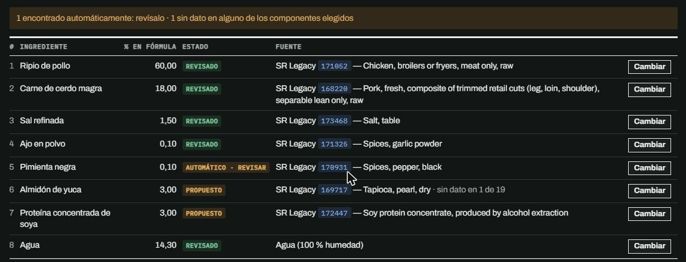
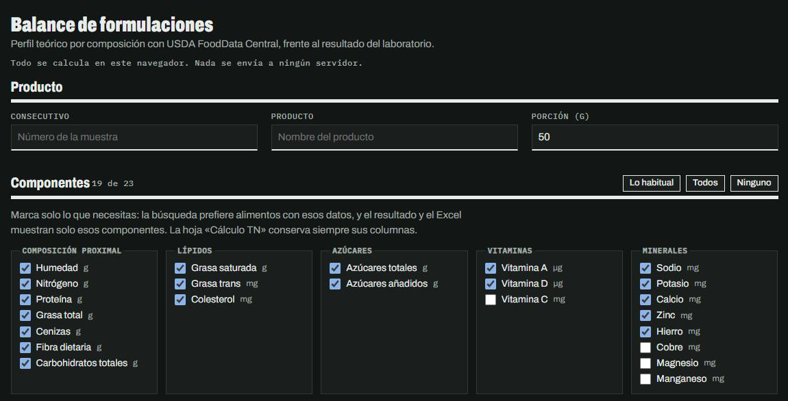

# Balance de formulaciones

Calcula el perfil nutricional teórico de una formulación a partir de su composición, con datos de USDA FoodData Central, y lo compara con el resultado del laboratorio. Devuelve los ID usados para cada ingrediente y un Excel con el cálculo.

**Abrir la herramienta:** https://camiloarteaga.github.io/balance-formulaciones/

Todo se calcula en el navegador. La formulación no se guarda ni se envía a ningún servidor.



## Cómo se usa

1. **Componentes.** Marca los que necesitas (proximal, lípidos, azúcares, vitaminas, minerales). La búsqueda prefiere alimentos que tengan esos datos, y el resultado y el Excel muestran solo esos.
2. **Formulación.** Pega desde Excel dos columnas: ingrediente y cantidad. Acepta %, g o kg; todo se lleva a 100 % en proporción.
3. **Revisa la fuente de cada ingrediente.** Se busca en este orden: biblioteca privada → biblioteca pública → USDA a partir del nombre en español.
4. **Resultado práctico.** Escribe los valores del laboratorio o carga el libro de Excel de resultados.
5. **Descargar Excel.**

| Estado | Qué significa |
| --- | --- |
| Revisado | ID evaluado y aceptado en una biblioteca. |
| Propuesto | Cambio de ID pendiente de aprobación. |
| Automático · revisar | Elegido por la búsqueda en USDA. Hay que confirmarlo o cambiarlo. |
| Sin fuente | No se encontró nada seguro. Se elige a mano o se carga su ficha técnica. |



## Cómo calcula

- **Teórico de la mezcla:** Σ(cantidad × valor por 100 g) / total de la fórmula.
- **Ajuste a la humedad medida:** los sólidos se multiplican por k = (100 − H<sub>lab</sub>) / (100 − H<sub>teórico</sub>).
- **Carbohidratos prácticos:** 100 − (humedad + proteína + grasa + cenizas).
- **Diferencia:** (ajustado − práctico) / práctico × 100.
- Si al alimento elegido le falta un componente, se completa con un alimento parecido de USDA y queda registrado qué ID lo aportó.
- Nitrógeno: USDA SR Legacy no lo trae; se deriva de la proteína con el factor de conversión de cada alimento (6,25 para valores de ficha técnica).

**Excel descargado:** hoja «Cálculo TN» (cálculo nutricional por 100 g y por porción, con calorías 4/9/4/2), teórico frente a práctico, aporte por ingrediente, y fuentes e ID.

## Fuentes de datos

- USDA FoodData Central: SR Legacy (abril 2018) y Foundation Foods (abril 2026), 8.262 alimentos, filtrados a los 23 componentes que usa la herramienta.
- Fichas técnicas de proveedores (Res. 810 de 2021, art. 10.5), solo en la biblioteca privada.

## Biblioteca privada

Los nombres comerciales y los valores de fichas técnicas **no están en este repositorio**. Se cargan como un JSON local con el botón «Cargar biblioteca privada» y quedan solo en ese navegador. El botón «Descargar biblioteca privada» guarda también los ID que elegiste a mano.

```json
[
  { "nombre": "Grasa de cerdo", "tipo": "usda", "fdc": "167813", "estado": "revisado", "nota": "Motivo de la elección" },
  { "nombre": "Aditivo X", "tipo": "valores", "ref": "Ficha técnica del proveedor (2025)",
    "valores": { "prot": 0, "grasa": 0, "cen": 38.5, "na": 12000 } },
  { "nombre": "Hielo", "tipo": "agua" }
]
```

`estado` es opcional: si falta, el ingrediente se muestra como «Revisado». Claves de `valores` (por 100 g): `hum` `n` `prot` `grasa` `sat` `trans` (mg) `azt` `aza` `fib` `cen` `cho` `vita` (µg) `vitd` (µg) `vitc` `col` `na` `k` `ca` `zn` `fe` `cu` `mg` `mn` (minerales, vit C y colesterol en mg).

## Estructura

| Archivo | Contenido |
| --- | --- |
| `index.html`, `estilos.css`, `app.js` | Página e interacción |
| `calculo.js` | Balance, ajuste a humedad, complementos y lectura del Excel de resultados |
| `busqueda.js` | Búsqueda en USDA a partir del nombre en español |
| `excel.js` | Excel descargable |
| `datos/usda.js` | Base USDA filtrada |
| `datos/biblioteca.js` | Biblioteca pública (solo ingredientes genéricos) |
| `scripts/generar_usda.py` | Regenera `datos/usda.js` desde los CSV de FoodData Central |
| `vendor/` | SheetJS 0.18.5 y ExcelJS 4.4.0 |

Para actualizar USDA: descargar los CSV de SR Legacy y Foundation desde https://fdc.nal.usda.gov/download-datasets, descomprimirlos en una carpeta y ejecutar `python scripts/generar_usda.py <carpeta>`.

## Límites

- La búsqueda automática es una sugerencia: todo lo que elige queda marcado para revisar. Frente a 103 ingredientes ya asignados a mano, coincide con el mismo alimento en 90.
- La base local no incluye USDA Branded ni FNDDS; esos ID se cargan como valores en la biblioteca privada.
- Los azúcares añadidos no vienen en USDA: salen de la formulación.
